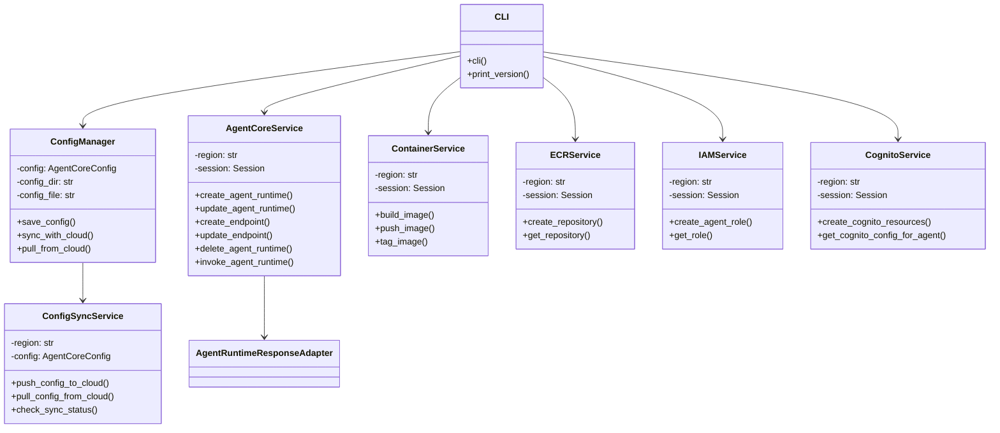
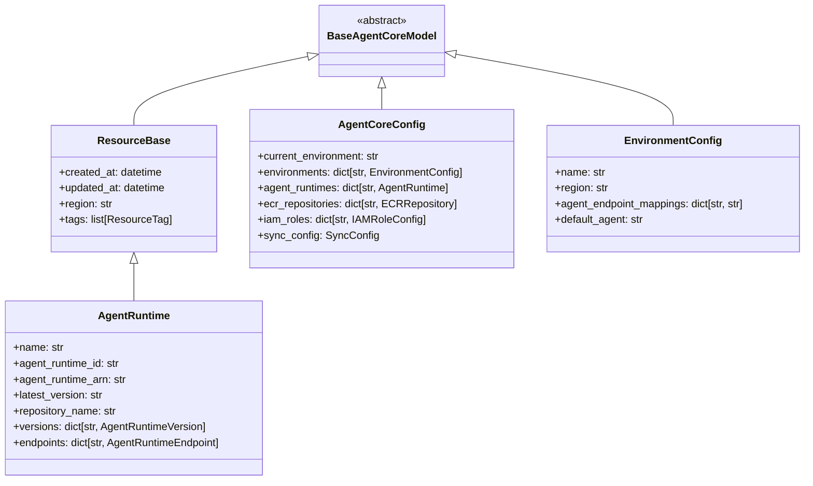

# Product Requirements Document (PRD) - AgentCore Platform CLI

## Overview

The AgentCore Platform CLI is a command-line interface tool that simplifies the deployment and management of Python and Docker-based AI agents to Amazon Bedrock AgentCore Runtime. It provides a unified, developer-friendly interface for the entire agent lifecycle, from development to deployment across multiple environments.

Similar to AWS Amplify CLI but tailored specifically for Bedrock AgentCore, this tool abstracts away the complexity of working with multiple AWS services including ECR, IAM, Parameter Store, and Cognito, allowing developers to focus on agent functionality rather than deployment infrastructure.

Key capabilities of the AgentCore Platform CLI include:

- Container-based agent deployment to Amazon Bedrock AgentCore Runtime
- Multi-environment management (dev, staging, prod)
- Agent versioning and endpoint management
- Configuration synchronization between local development and AWS cloud environments
- Integration with AWS identity and access management
- CLI-based agent invocation for testing and development

The AgentCore Platform CLI enables organizations to standardize their AI agent development workflows, accelerate deployment, and maintain consistent agent configurations across environments.

## Objectives and Goals

### Primary Objectives

- **Simplify Agent Deployment**: Reduce the complexity of deploying AI agents to Amazon Bedrock AgentCore Runtime through an intuitive CLI interface.
- **Standardize Environment Management**: Provide a consistent approach to managing agents across development, staging, and production environments.
- **Automate Infrastructure Setup**: Automatically provision and configure necessary AWS resources including ECR repositories, IAM roles, and Cognito resources.
- **Enable Configuration Synchronization**: Maintain consistency between local development configurations and cloud-deployed resources.
- **Support the Full Agent Lifecycle**: Provide tools for creating, updating, deploying, testing, and deleting agents.

### Strategic Goals

- Accelerate time-to-market for AI agent deployments by 50%
- Reduce operational overhead for managing agent infrastructure by 40%
- Enable consistent agent behavior across multiple environments
- Facilitate integration with CI/CD pipelines for automated agent deployment
- Lower the barrier to entry for working with Amazon Bedrock AgentCore
- Provide a foundation for team collaboration on agent development

## Target Users and Use Cases

### Target Users

1. **ML Engineers**
   - Deploy machine learning models as containerized agents
   - Test agent performance across different environments
   - Iterate on agent versions quickly

2. **Software Engineers**
   - Integrate AI capabilities into applications
   - Develop custom agents with specific business logic
   - Set up secure endpoints for application-to-agent communication

3. **DevOps Engineers**
   - Manage agent deployments across environments
   - Integrate agent deployment into CI/CD pipelines
   - Monitor and maintain agent infrastructure

4. **Data Scientists**
   - Test and prototype AI agents
   - Deploy experimental models for validation
   - Iterate on agent behavior based on feedback

5. **AI/ML Operations Teams**
   - Manage multiple agent versions
   - Control access to agent endpoints
   - Coordinate agent deployments across teams

### Key Use Cases

1. **Agent Development and Deployment**
   - Creating a new agent from a local Docker container
   - Deploying an agent to development, staging, and production environments
   - Updating an agent with new functionality or improved models

2. **Environment Management**
   - Setting up distinct environments with appropriate configurations
   - Switching between environments for testing and deployment
   - Synchronizing configurations across environments

3. **Version Control and Testing**
   - Managing multiple versions of an agent
   - Creating endpoints for specific agent versions
   - Testing agents through CLI-based invocation

4. **Security and Access Management**
   - Setting up authentication for agent access
   - Managing IAM roles and permissions
   - Implementing secure endpoint access

5. **Integration and Automation**
   - Incorporating agent deployment into CI/CD workflows
   - Automating agent updates based on model improvements
   - Integrating agents with application backends

## Functional Requirements

### Core Commands

The AgentCore Platform CLI provides a comprehensive set of commands organized into logical groups:

#### Setup and Initialization

```bash
agentcore-cli init [--region <region>] [--profile <profile>] [--no-interactive]
agentcore-cli --version
```

#### Environment Management

```bash
agentcore-cli env list
agentcore-cli env use <n>
agentcore-cli env create <n> [--region <region>]
agentcore-cli env current
agentcore-cli env delete <n>
```

#### Agent Management

```bash
agentcore-cli agent create <name> [--dockerfile <path>] [--description <text>] [--environment <env>]
agentcore-cli agent update <name> [--dockerfile <path>] [--description <text>]
agentcore-cli agent list [--environment <env>]
agentcore-cli agent delete <name> [--environment <env>]
agentcore-cli agent status <name> [--environment <env>]
agentcore-cli agent invoke <name> [--prompt <prompt>]
```

#### Configuration Management

```bash
agentcore-cli config export --file <path>
agentcore-cli config import --file <path>
agentcore-cli config set-default-agent <name> [--environment <env>]
agentcore-cli config show [--environment <env>]
agentcore-cli config validate
```

#### Sync Management

```bash
agentcore-cli config sync enable [--auto]
agentcore-cli config sync disable
agentcore-cli config sync status
agentcore-cli config sync pull
agentcore-cli config sync push
```

### Detailed Requirements

#### Setup Command

- Interactive mode guides users through AWS credentials setup
- Validates AWS permissions
- Configures default region
- Sets up initial environment(s)
- Creates initial configuration files and directories

#### Agent Create Command

- Validates agent name and Docker file
- Creates ECR repository if not exists
- Builds Docker image locally
- Tags image with appropriate version
- Pushes image to ECR
- Creates or uses specified IAM role
- Creates agent runtime on Bedrock AgentCore
- Creates default endpoint for the agent

#### Agent Update Command

- Validates agent exists in current environment
- Builds and pushes new Docker image if Docker file specified
- Creates new agent runtime version
- Updates agent metadata in local configuration

#### Agent Invoke Command

- Validates agent and endpoint existence
- Formats input appropriately
- Sends request to Bedrock AgentCore
- Handles streaming responses
- Formats and displays agent response

## Non-Functional Requirements

### Performance

- Non-resource-intensive commands should complete in < 2 seconds
- Agent creation (including Docker build and push) should complete in < 10 minutes
- Long-running operations should provide progress indicators

### Security

- Secure handling of AWS credentials using AWS SDK best practices
- Creation of least-privilege IAM roles
- Secure storage of configuration data
- Support for Cognito-based authentication

### Reliability

- Graceful handling of AWS service errors
- Clear error messages with actionable information
- Automatic retry for transient failures
- Proper cleanup of resources on failure

### Compatibility

- Support for Python 3.8+
- Cross-platform compatibility (Linux, macOS, Windows)
- Support for common CI/CD platforms

### Scalability

- Support for managing 100+ agents
- Efficient handling of multiple environments
- Performance that scales with number of resources

## User Experience Guidelines

### Command Structure

- All commands follow verb-noun format
- Consistent parameter naming across commands
- Logical grouping of related commands

### Feedback and Output

- Progress indicators for long-running operations
- Consistent color coding for different message types
- Support for multiple output formats

### Error Handling

- Clear, concise error messages
- Early validation of inputs before execution
- Suggestions for recovering from failures

## Technical Architecture

The CLI follows a layered architecture:



### Data Model



## Development Roadmap

### Phase 1: Foundation (MVP)

- CLI Core Setup
- Basic Agent Runtime Management
- Container Management
- Configuration Storage

### Phase 2: Enhanced Functionality

- Endpoint Management
- Agent Invocation
- IAM and Permissions
- Environment Management

### Phase 3: Advanced Features

- Authentication with Cognito
- Configuration Synchronization
- Agent Version Management
- CI/CD Integration

## Assumptions and Constraints

### Assumptions

- Users have Docker installed and properly configured
- Users have Python 3.8+ installed
- Users have AWS credentials with appropriate permissions
- Users have access to Amazon Bedrock AgentCore Runtime

### Constraints

- Limited by Amazon Bedrock AgentCore Runtime quotas
- Docker image size limitations
- No support for non-AWS cloud providers
- Limited to AWS-supported authentication mechanisms

## Success Metrics

### Usability Metrics

- Initial agent deployment time < 10 minutes
- Number of commands to deploy an agent ≤ 3
- User satisfaction rating > 4/5

### Performance Metrics

- Non-resource-intensive command response time < 2 seconds
- Agent deployment time (excluding Docker build) < 3 minutes
- Error rate < 5% of operations

### Business Impact Metrics

- Time-to-market for AI agent deployments reduced by 50%
- Operational overhead for managing agents reduced by 40%
- Number of environments used per project average ≥ 2.5

## AWS Permissions Requirements

The AgentCore Platform CLI requires permissions for:

- Bedrock AgentCore operations
- ECR repository management
- IAM role creation and management
- SSM Parameter Store operations
- Cognito resources (optional)

## Common Workflow Examples

### Basic Agent Deployment Workflow

```bash
# Initialize the CLI
agentcore-cli init

# Create a new agent
agentcore-cli agent create my-agent --dockerfile ./Dockerfile --description "My custom agent"

# Test the agent
agentcore-cli agent invoke my-agent --prompt "Hello, agent!"

# Create a staging environment
agentcore-cli env create staging --region us-west-2

# Switch to staging
agentcore-cli env use staging

# Deploy to staging
agentcore-cli agent create my-agent --dockerfile ./Dockerfile
```
