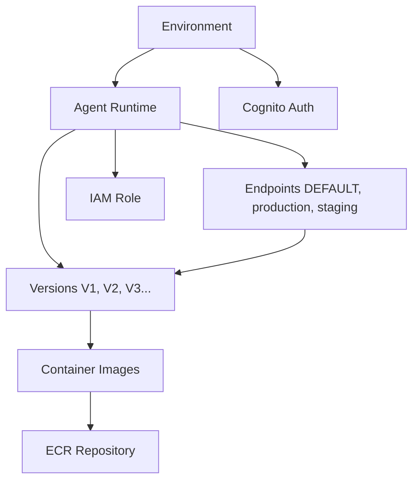

# AgentCore CLI

**The easiest way to deploy and manage AI agents on Amazon Bedrock AgentCore Runtime**

A sophisticated command-line interface that brings **environment-first architecture** and **single-command deployment** to AI agent management. Deploy from container to runtime in one command, manage multiple environments, and scale from development to production with confidence.

> **Note**: Amazon Bedrock AgentCore is currently in preview release and is subject to change.

## 🚀 **Core Values**

### **Environment-First Design**

Complete isolation between `dev`, `staging`, and `prod` environments. Each environment maintains its own agent runtimes, endpoints, and configurations with independent AWS regions.

### **Agent Lifecycle Management**

Immutable versioning system where every update creates a new version. Endpoints can point to any version, enabling safe rollbacks and blue-green deployments.

### **Container-Native**

Built for Docker workflows with Amazon Bedrock AgentCore Runtime. Works with any agent framework including LangGraph, CrewAI, Strands Agents, and custom implementations. Supports 100MB payloads, extended runtime (up to 8 hours), and session isolation.

### **Infrastructure as Code**

CloudFormation templates for ECR repositories, IAM roles, and Cognito resources. Consistent, repeatable deployments with full resource lifecycle management.

### **Configuration Sync**

Synchronize configuration between local development and cloud (AWS Parameter Store) with intelligent drift detection using DeepDiff.

### **Security-First**

Integrated IAM role management and Cognito authentication. Every agent gets appropriate permissions and secure access patterns with built-in identity management.

## 📋 **Architecture Overview**

### **Environment-First Model**

```yaml
agentcore-config:
  current_environment: "dev"
  environments:
    dev:
      region: "us-west-2"
      agent_runtimes:
        my-chat-bot:
          versions: { "V1": {...}, "V2": {...} }
          endpoints: { "DEFAULT": "V2", "stable": "V1" }
        data-processor:
          versions: { "V1": {...} }
          endpoints: { "DEFAULT": "V1" }
    prod:
      region: "us-east-1"
      agent_runtimes:
        my-chat-bot:
          versions: { "V1": {...} }
          endpoints: { "DEFAULT": "V1" }
  global_resources:
    ecr_repositories: {...}
    iam_roles: {...}
    sync_config: {...}
```

### **Agent Runtime Hierarchy**



## ⚡ **Quick Start**

### **1. Initialize**

```bash
# Interactive setup wizard
agentcore-cli init

# Or automated setup
agentcore-cli init --no-interactive --region us-west-2 --environment dev
```

### **2. Deploy an Agent (Single Command!)**

```bash
# Creates ECR repo, builds image, creates IAM role, deploys runtime
agentcore-cli agent create my-chat-bot

# With custom settings
agentcore-cli agent create ml-processor \
  --environment prod \
  --image-tag v1.0.0 \
  --dockerfile ./production.Dockerfile \
  --build-args API_KEY=secret123
```

### **3. Test Immediately**

```bash
agentcore-cli agent invoke my-chat-bot --prompt "Hello, how are you?"
```

### **4. Manage Environments**

```bash
# Create production environment
agentcore-cli env create prod --region us-east-1

# Switch to production
agentcore-cli env use prod

# Deploy to production
agentcore-cli agent create my-chat-bot --environment prod
```

## 🏗️ **Project Structure**

```bash
agentcore-cli/
├── agentcore_cli/
│   ├── cli.py                   # Main CLI entry point
│   ├── commands/                # Command groups
│   │   ├── unified_agent.py     # Agent lifecycle (create, update, invoke)
│   │   ├── environment.py       # Environment management
│   │   ├── container.py         # Docker & ECR operations
│   │   ├── config.py           # Configuration management
│   │   ├── resources.py        # AWS resource management
│   │   └── setup.py            # Initial setup wizard
│   ├── services/               # Business logic layer
│   │   ├── agentcore.py        # AgentCore API operations
│   │   ├── containers.py       # Docker build/push
│   │   ├── ecr.py             # ECR repository management
│   │   ├── iam.py             # IAM role management
│   │   ├── cognito.py         # Cognito authentication
│   │   ├── config.py          # Configuration management
│   │   └── config_sync.py     # Cloud synchronization
│   ├── models/                # Data models
│   │   ├── config.py          # Environment-first config models
│   │   ├── runtime.py         # Agent runtime models
│   │   ├── resources.py       # AWS resource models
│   │   ├── inputs.py          # Service input models
│   │   └── responses.py       # Service response models
│   └── utils/                 # Utilities
│       ├── aws_utils.py       # AWS helpers
│       ├── validation.py      # Input validation
│       └── cfn_utils.py       # CloudFormation utilities
├── tests/                     # Comprehensive test suite
├── docs/                      # Documentation
└── pyproject.toml            # Project configuration
```

## 🎯 **Core Features**

### **Environment Management**

```bash
# List all environments
agentcore-cli env list --verbose

# Create new environment
agentcore-cli env create staging --region us-west-2 --set-current

# Show current environment details
agentcore-cli env current

# Manage environment variables
agentcore-cli env vars --set API_URL=https://api.staging.com
agentcore-cli env vars --list

# Delete environment (with safety confirmation)
agentcore-cli env delete old-env --force
```

### **Agent Lifecycle**

```bash
# Complete workflow in one command
agentcore-cli agent create my-agent

# Update creates new immutable version
agentcore-cli agent update my-agent --image-tag v2.0.0

# View agent status and versions
agentcore-cli agent status my-agent

# List all agents in current environment
agentcore-cli agent list

# Invoke agent with rich output
agentcore-cli agent invoke my-agent --prompt "Analyze this data"

# Safe deletion with resource cleanup
agentcore-cli agent delete my-agent --keep-ecr
```

### **Configuration Management**

```bash
# View current configuration
agentcore-cli config show

# Validate configuration integrity
agentcore-cli config validate

# Export/import for backup and sharing
agentcore-cli config export --file backup.json
agentcore-cli config import backup.json --force

# Set default agent for environment
agentcore-cli config set-default-agent my-main-bot

# Enable cloud sync with AWS Parameter Store
agentcore-cli config sync enable --auto

# Check for configuration drift
agentcore-cli config sync status

# Manual sync operations
agentcore-cli config sync push  # Local → Cloud
agentcore-cli config sync pull  # Cloud → Local
```

**Example Drift Detection:**

```bash
⚠️  Configuration drift detected!
  environments: 2 items differ
  agent_runtimes: 1 items differ
  global_resources: 0 items differ

Changes detected:
• Environment 'dev': Agent runtime 'my-bot' version changed V1 → V2
• Environment 'prod': New agent runtime 'analytics-engine' added
```

### **Infrastructure Management**

```bash
# ECR repository management
agentcore-cli resources ecr create my-repo --image-scanning
agentcore-cli resources ecr list
agentcore-cli resources ecr delete old-repo --force

# IAM role management
agentcore-cli resources iam create my-agent --environment prod
agentcore-cli resources iam list --environment prod

# Cognito authentication setup
agentcore-cli resources cognito create my-agent --allow-signup
agentcore-cli resources cognito list
```

### **Container Operations**

```bash
# Build container images with AgentCore compatibility
agentcore-cli container build my-agent --dockerfile ./docker/Dockerfile

# Push to ECR (creates repository if needed)
agentcore-cli container push my-agent --tag v1.0.0 --create-repo

# List container images across repositories
agentcore-cli container list --repository my-agent

# Pull images for local testing
agentcore-cli container pull my-agent --tag v1.0.0

# Clean up images (local and/or ECR)
agentcore-cli container remove my-agent --local-only
```

## 🔧 **Configuration**

### **Configuration File Structure**

```json
{
  "current_environment": "dev",
  "environments": {
    "dev": {
      "region": "us-west-2",
      "agent_runtimes": { "my-bot": {...} },
      "default_agent_runtime": "my-bot",
      "environment_variables": { "DEBUG": "true" },
      "cognito": { "user_pool_id": "...", "app_client_id": "..." }
    }
  },
  "global_resources": {
    "ecr_repositories": { "my-bot": {...} },
    "iam_roles": { "agentcore-my-bot-dev-role": {...} },
    "sync_config": {
      "cloud_config_enabled": true,
      "auto_sync_enabled": true,
      "parameter_store_prefix": "/agentcore"
    }
  }
}
```

## 🚀 **Development Workflow**

### **Local Development**

```bash
# 1. Set up development environment
agentcore-cli env create dev --region us-west-2 --set-current

# 2. Create and test agent locally
agentcore-cli agent create my-bot --no-deploy  # Build only, skip deployment
docker run -it my-bot:latest               # Test locally

# 3. Deploy when ready
agentcore-cli agent create my-bot               # Full deployment

# 4. Iterate quickly
agentcore-cli agent update my-bot --image-tag v2
agentcore-cli agent invoke my-bot --prompt "Test update"
```

### **Production Deployment**

```bash
# 1. Create production environment
agentcore-cli env create prod --region us-east-1

# 2. Deploy to production
agentcore-cli env use prod
agentcore-cli agent create my-bot --environment prod --image-tag v1.0.0

# 3. Verify deployment
agentcore-cli agent status my-bot
agentcore-cli agent invoke my-bot --prompt "Production health check"
```

### **Team Collaboration**

```bash
# 1. Enable cloud sync for team sharing
agentcore-cli config sync enable --auto

# 2. Team members pull shared configuration
agentcore-cli config sync pull

# 3. Share environment setups
agentcore-cli config export --file team-config.json
# Share file with team
agentcore-cli config import team-config.json
```

## 🔐 **Security Features**

### **IAM Integration**

- Automatic IAM role creation with least-privilege principles
- Bedrock AgentCore execution permissions
- S3 read-only access for data processing
- CloudWatch Logs for monitoring
- Bedrock model invocation permissions

### **Cognito Authentication**

- User Pool and Identity Pool creation
- Configurable authentication flows
- Self-registration and email verification options
- Integration with agent access patterns
- Built-in identity management for AgentCore Runtime

### **Environment Isolation**

- Complete separation between environments
- Region-specific deployments
- Independent IAM roles per environment
- Secure credential management
- Session isolation with dedicated microVMs

## 🛠️ **AgentCore Runtime Capabilities**

### **Framework Support**

- **Framework Agnostic**: Works with LangGraph, CrewAI, Strands Agents, and custom implementations
- **Model Flexibility**: Supports any LLM (Amazon Bedrock, Anthropic Claude, Google Gemini, OpenAI)
- **Protocol Support**: Model Context Protocol (MCP) for agent communication

### **Runtime Features**

- **Extended Execution**: Up to 8 hours for complex reasoning and multi-agent collaboration
- **Enhanced Payloads**: 100MB payload support for multi-modal content (text, images, audio, video)
- **Session Isolation**: Dedicated microVMs with isolated CPU, memory, and filesystem
- **Consumption Pricing**: Pay only for resources consumed, not pre-allocated capacity

### **Built-in Services**

- **Authentication**: Seamless integration with corporate identity providers
- **Observability**: Specialized tracing for agent reasoning steps and tool invocations
- **Tools**: Built-in browser automation and code interpretation capabilities
- **Memory**: Context-aware agents with short-term and long-term memory management

## 📊 **Error Handling and Troubleshooting**

### **Comprehensive Validation**

```bash
# Configuration validation
agentcore-cli config validate

# Check sync status and drift
agentcore-cli config sync status

# Verify AWS credentials and permissions
agentcore-cli init --no-interactive  # Will validate AWS access
```

### **CloudFormation Polling**

The CLI provides robust CloudFormation stack monitoring:

- Real-time progress updates during stack operations
- Automatic failure detection with detailed error reporting
- Timeout handling with configurable timeouts
- Success/failure state verification before proceeding

### **Rich Error Messages**

```bash
❌ Agent 'my-bot' not found in environment 'dev'
Available agents: data-processor, analytics-engine
💡 Create it first: agentcore-cli agent create my-bot

❌ ECR repository 'my-repo' not found: RepositoryNotFound
💡 Create repository: agentcore-cli resources ecr create my-repo

⚠️  Configuration drift detected!
💡 Sync changes: agentcore-cli config sync push
```

## 🛠️ **Development Setup**

### **Prerequisites**

- Python 3.11+
- Docker installed and running
- AWS CLI configured with appropriate permissions
- Access to Amazon Bedrock AgentCore Runtime (Preview)

### **Installation**

```bash
# Install from PyPI (when published)
pip install agentcore-cli

# Or install from source
git clone https://github.com/yourusername/agentcore-cli.git
cd agentcore-cli
uv sync  # Using uv for dependency management
```

### **Required AWS Permissions**

The CLI requires IAM permissions for:

- Bedrock AgentCore (runtime management)
- ECR (repository and image management)
- IAM (role creation and management)
- CloudFormation (stack management)
- Cognito (user pool management)
- Parameter Store (configuration sync)
- CloudWatch Logs (monitoring)

### **Development Commands**

```bash
# Run tests
uv run pytest tests/ -v

# Type checking
uv run mypy agentcore_cli/

# Code formatting and linting
uv run ruff format agentcore_cli/
uv run ruff check --fix agentcore_cli/

# Quality checks
uv run poe code-quality

# Security scans
uv run poe scan
```

## 📚 **Learning Resources**

### **AWS Documentation**

- [Bedrock AgentCore Developer Guide](https://docs.aws.amazon.com/bedrock-agentcore/latest/devguide/)
- [Bedrock AgentCore API Reference](https://docs.aws.amazon.com/bedrock-agentcore/latest/APIReference/)
- [Bedrock AgentCore Control API](https://docs.aws.amazon.com/bedrock-agentcore-control/latest/APIReference/)
- [AgentCore Runtime Getting Started](https://docs.aws.amazon.com/bedrock-agentcore/latest/devguide/runtime-getting-started.html)

### **CLI Help System**

```bash
# Global help
agentcore-cli --help

# Command group help
agentcore-cli agent --help
agentcore-cli env --help
agentcore-cli config --help
agentcore-cli resources --help

# Specific command help
agentcore-cli agent create --help
agentcore-cli config sync --help
```

### **Interactive Setup**

```bash
# Guided setup with explanations
agentcore-cli init --interactive
```

## 🤝 **Contributing**

We welcome contributions! Please see our contributing guidelines:

1. Fork the repository
2. Create a feature branch
3. Make your changes with tests
4. Submit a pull request

### **Development Principles**

- Environment-first architecture
- Comprehensive error handling
- Rich user experience with clear feedback
- Type safety with Pydantic models
- Thorough testing coverage

## 🆘 **Support**

### **Getting Help**

- Check the built-in help: `agentcore-cli <command> --help`
- Validate your configuration: `agentcore-cli config validate`
- Check sync status: `agentcore-cli config sync status`

### **Common Issues**

- **AWS Credentials**: Ensure AWS CLI is configured with proper permissions
- **Docker**: Verify Docker is installed and running
- **Regions**: Ensure consistent region configuration across environments
- **Permissions**: Check IAM permissions for AgentCore, ECR, and CloudFormation
- **Preview Service**: Remember AgentCore is in preview and features may change

### **Reporting Issues**

Please report issues with:

- Full command that failed
- Error messages
- Environment information (`agentcore-cli config show`)
- AWS region and account information

## 📄 **License**

This project is licensed under the MIT License - see the LICENSE file for details.

---

**Built with ❤️ for the AI developer community**

*Deploy smarter, not harder. One command, infinite possibilities.*
