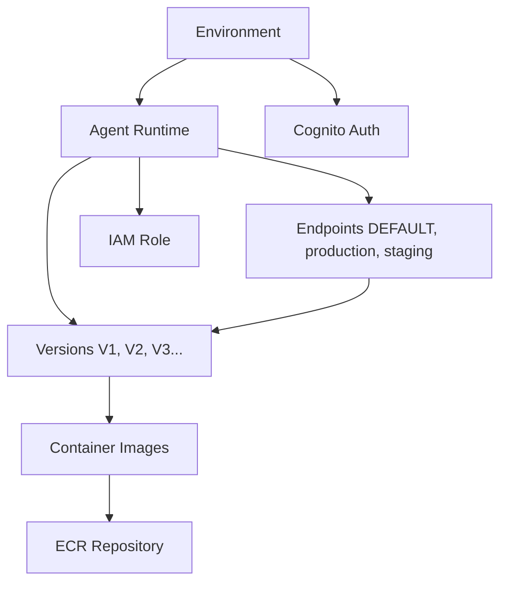

# Architecture Overview

AgentCore CLI is built with an **environment-first architecture** that provides clean separation between development, staging, and production environments. This document explains the core architectural concepts and how they work together.

## Environment-First Architecture

The foundation of AgentCore CLI is its environment-first architecture. This means:

- **Complete Environment Isolation**: Dev, staging, and production environments are fully isolated from each other
- **Region-Specific Deployments**: Each environment can be deployed in a different AWS region
- **Independent Resources**: Each environment has its own set of AWS resources (IAM roles, agent runtimes, etc.)
- **Configuration Separation**: Environment-specific configuration with inheritance options

This approach ensures that development and testing activities never impact production systems.

## Hierarchical Structure

The AgentCore CLI configuration follows a hierarchical structure:

```
AgentCore Config
├── Environments (dev, staging, prod)
│   ├── Region
│   ├── Agent Runtimes
│   │   ├── Versions
│   │   └── Endpoints
│   ├── Environment Variables
│   └── Cognito Configuration
└── Global Resources
    ├── ECR Repositories
    ├── IAM Roles
    └── Sync Configuration
```

This hierarchy is reflected in both the CLI commands and the underlying configuration file.

## Agent Runtime Hierarchy

Each agent runtime follows a versioned architecture:



Key concepts:

- **Immutable Versions**: Each update creates a new version, never modifying existing ones
- **Endpoint Management**: Endpoints can point to any version, enabling safe rollbacks and blue-green deployments
- **Resource Association**: Each agent is associated with specific IAM roles and ECR repositories

## Configuration Model

The configuration model uses a JSON structure stored locally and optionally synced to AWS Parameter Store:

```json
{
  "current_environment": "dev",
  "environments": {
    "dev": {
      "region": "us-west-2",
      "agent_runtimes": { "my-bot": {...} },
      "default_agent_runtime": "my-bot",
      "environment_variables": { "DEBUG": "true" },
      "cognito": { "user_pool_id": "...", "app_client_id": "..." }
    },
    "prod": {
      "region": "us-east-1",
      "agent_runtimes": { "my-bot": {...} },
      "default_agent_runtime": "my-bot",
      "environment_variables": { "DEBUG": "false" },
      "cognito": { "user_pool_id": "...", "app_client_id": "..." }
    }
  },
  "global_resources": {
    "ecr_repositories": { "my-bot": {...} },
    "iam_roles": { "agentcore-my-bot-dev-role": {...} },
    "sync_config": {
      "cloud_config_enabled": true,
      "auto_sync_enabled": true,
      "parameter_store_prefix": "/agentcore"
    }
  }
}
```

The configuration tracks:

- Environment settings and resources
- Agent runtime versions and endpoints
- AWS resources across environments
- Cloud sync preferences

## Infrastructure as Code

All AWS resources are created using CloudFormation templates:

- **ECR Repositories**: For storing container images
- **IAM Roles**: For agent runtime execution permissions
- **Cognito Resources**: For authentication

This ensures consistent, repeatable deployments with proper lifecycle management.

## Security Model

The security model is based on several key principles:

1. **Least Privilege**: Each agent gets only the permissions it needs
2. **Identity Management**: Integrated Cognito authentication
3. **Environment Isolation**: Security boundaries between environments
4. **Session Isolation**: Dedicated microVMs with isolated resources

## Container-Native Design

AgentCore CLI is designed to work with Docker containers:

- **Build Support**: Integrated Docker build capabilities
- **ECR Integration**: Automatic repository creation and image management
- **Runtime Compatibility**: Works with the Amazon Bedrock AgentCore Runtime

## AgentCore Runtime Capabilities

AgentCore CLI leverages the Amazon Bedrock AgentCore Runtime, which provides:

- **Extended Execution**: Up to 8 hours for complex reasoning tasks
- **Enhanced Payloads**: 100MB payload support for multi-modal content
- **Session Isolation**: Dedicated microVMs with isolated CPU, memory, and filesystem
- **Framework Agnostic**: Works with LangGraph, CrewAI, Strands Agents, and custom implementations

## Configuration Sync

The configuration sync system allows for:

- **Local/Cloud Synchronization**: Sync configuration between local development and AWS Parameter Store
- **Drift Detection**: Intelligent detection of configuration differences
- **Team Collaboration**: Share configuration across team members
- **Automatic Sync**: Optional automatic sync during operations

## Command Structure

The CLI command structure mirrors the architectural hierarchy:

- <i data-feather="layers"></i> `agentcore-cli env` - Environment management
- <i data-feather="package"></i> `agentcore-cli agent` - Agent lifecycle management
- <i data-feather="box"></i> `agentcore-cli container` - Docker operations
- <i data-feather="settings"></i> `agentcore-cli config` - Configuration management
- <i data-feather="server"></i> `agentcore-cli resources` - AWS resource management

## Next Steps

- Learn about [Environment-First Design](environment-first.md)
- Understand the [Security Model](security.md)
- Explore [AgentCore Runtime](agentcore-runtime.md) capabilities
