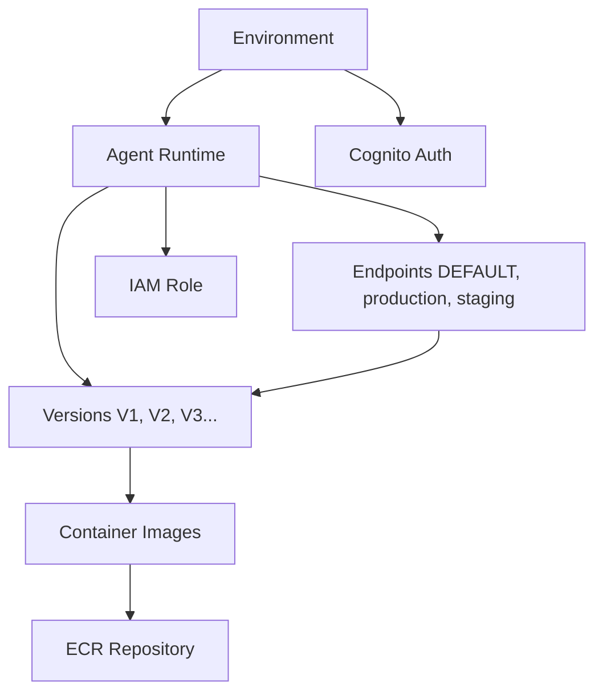

# AgentCore CLI

**The easiest way to deploy and manage AI agents on Amazon Bedrock AgentCore Runtime**

A sophisticated command-line interface that brings **environment-first architecture** and **single-command deployment** to AI agent management. Deploy from container to runtime in one command, manage multiple environments, and scale from development to production with confidence.

!!! note
    Amazon Bedrock AgentCore is currently in preview release and is subject to change.

## 🚀 **Core Values**

<div class="grid cards" markdown>

- <i data-feather="layers" style="color: var(--md-primary-fg-color);"></i> | **Environment-First Design**

    Complete isolation between `dev`, `staging`, and `prod` environments. Each environment maintains its own agent runtimes, endpoints, and configurations with independent AWS regions.

- <i data-feather="clock" style="color: var(--md-primary-fg-color);"></i> | **Agent Lifecycle Management**

    Immutable versioning system where every update creates a new version. Endpoints can point to any version, enabling safe rollbacks and blue-green deployments.

- <i data-feather="package" style="color: var(--md-primary-fg-color);"></i> | **Container-Native**

    Built for Docker workflows with Amazon Bedrock AgentCore Runtime. Works with any agent framework including LangGraph, CrewAI, Strands Agents, and custom implementations.

- <i data-feather="code" style="color: var(--md-primary-fg-color);"></i> | **Infrastructure as Code**

    CloudFormation templates for ECR repositories, IAM roles, and Cognito resources. Consistent, repeatable deployments with full resource lifecycle management.

- <i data-feather="refresh-cw" style="color: var(--md-primary-fg-color);"></i> | **Configuration Sync**

    Synchronize configuration between local development and cloud (AWS Parameter Store) with intelligent drift detection using DeepDiff.

- <i data-feather="shield" style="color: var(--md-primary-fg-color);"></i> | **Security-First**

    Integrated IAM role management and Cognito authentication. Every agent gets appropriate permissions and secure access patterns with built-in identity management.

</div>

## ⚡ **Quick Start**

=== "Initialize"

    ```bash
    # Interactive setup wizard
    agentcore-cli init

    # Or automated setup
    agentcore-cli init --no-interactive --region us-west-2 --environment dev
    ```

=== "Deploy an Agent"

    ```bash
    # Creates ECR repo, builds image, creates IAM role, deploys runtime
    agentcore-cli agent create my-chat-bot

    # With custom settings
    agentcore-cli agent create ml-processor \
      --environment prod \
      --image-tag v1.0.0 \
      --dockerfile ./production.Dockerfile \
      --build-args API_KEY=secret123
    ```

=== "Test Immediately"

    ```bash
    agentcore-cli agent invoke my-chat-bot --prompt "Hello, how are you?"
    ```

=== "Manage Environments"

    ```bash
    # Create production environment
    agentcore-cli env create prod --region us-east-1

    # Switch to production
    agentcore-cli env use prod

    # Deploy to production
    agentcore-cli agent create my-chat-bot --environment prod
    ```

## 📚 **Documentation Sections**

<div class="grid cards" markdown>

- <i data-feather="plus-square" style="color: var(--md-primary-fg-color);"></i> | **[Getting Started](/getting-started/)**

    Install the CLI, set up your AWS credentials, and deploy your first agent in minutes.

- <i data-feather="book-open" style="color: var(--md-primary-fg-color);"></i> | **[User Guide](/user-guide/)**

    Learn about environments, agent lifecycle, containers, configuration, and resource management.

- <i data-feather="git-branch" style="color: var(--md-primary-fg-color);"></i> | **[Architecture](/architecture/)**

    Understand environment-first design, security model, and AgentCore Runtime capabilities.

- <i data-feather="terminal" style="color: var(--md-primary-fg-color);"></i> | **[CLI Reference](/cli-reference/)**

    Comprehensive reference for all commands, options, and arguments.

- <i data-feather="compass" style="color: var(--md-primary-fg-color);"></i> | **[Tutorials](/tutorials/)**

    Step-by-step guides for common workflows and advanced features.

- <i data-feather="code" style="color: var(--md-primary-fg-color);"></i> | **[Examples](/examples/)**

    Ready-to-deploy examples for different agent frameworks.

- <i data-feather="alert-circle" style="color: var(--md-primary-fg-color);"></i> | **[Troubleshooting](/troubleshooting/)**

    Common issues, error messages, and debugging tips.

- <i data-feather="database" style="color: var(--md-primary-fg-color);"></i> | **[API Reference](/api-reference/)**

    Auto-generated documentation for the Python library.

</div>

## 🧩 **Architecture Overview**

The AgentCore CLI uses an environment-first architecture that provides clean separation between development, staging, and production environments:



## 🛠️ **Development Setup**

### **Prerequisites**

- Python 3.11+
- Docker installed and running
- AWS CLI configured with appropriate permissions
- Access to Amazon Bedrock AgentCore Runtime (Preview)

### **Installation**

```bash
# Install from PyPI (when published)
pip install agentcore-cli

# Or install from source
git clone https://github.com/yourusername/agentcore-cli.git
cd agentcore-cli
uv sync  # Using uv for dependency management
```

---

**Built with ❤️ for the AI developer community**

*Deploy smarter, not harder. One command, infinite possibilities.*
